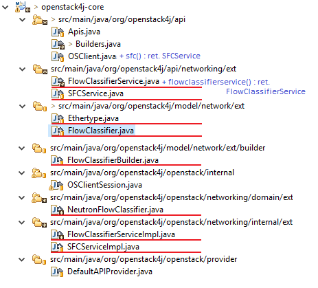
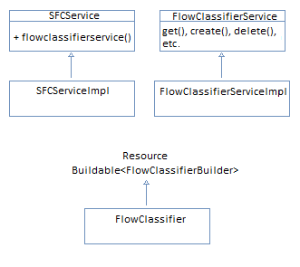

# SFC Support for Openstack4j: code changes.

Service Function Chaining REST Api for the openstack has been available since mitaka release. It deals with four kinds of objects:
flow classifiers, port pairs, port pair groups and port chains. We have added completed the flow classifiers addition for the project. 
The following summarizes that pull request submitted to the [openstack4j project](https://github.com/ContainX/openstack4j). 

The remaining three object types will be added following the same basic pattern.

## Design Changes
We add ```SFCService``` (naming?) under ```api/networking/ext```. This service will be on the same level of service objects as the existing [```NetworkingService```](https://github.com/ContainX/openstack4j/blob/master/core/src/main/java/org/openstack4j/api/networking/NetworkingService.java). That means ```SFCService``` shall:

- Return ```FlowClassifierService``` from ```flowclassifiers()``` call.
- Similar calls will later be added for  ```PortGroupService```, ```PortPairService```, ```PortGroupChainService```.
- These four services will be lower-level CRUD services, much like  [```NetworkService```](https://github.com/ContainX/openstack4j/blob/master/core/src/main/java/org/openstack4j/api/networking/NetworkService.java).
- All four lower-level services will implement [```Buildable```](https://github.com/ContainX/openstack4j/blob/master/core/src/main/java/org/openstack4j/common/Buildable.java) and the builders will be provided in the Impl.
-  ```OS.sfc()``` call shall return an implementation of  ```SFCService```

### Code changes.



### FlowClassifier class diagram.
Flow classifiers follow the existing pattern:



## Assignees
Dmitry Gerenrot ([dmitryintel](https://github.com/dmitryintel)).

## References
[SFC REST Api for openstack](https://github.com/ContainX/openstack4j/blob/master/core/src/main/java/org/openstack4j/api/networking/NetworkingService.java)

[ContainX/openstack4j project](https://github.com/ContainX/openstack4j)